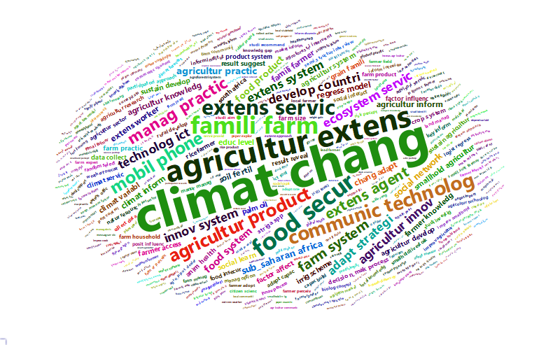

```{r setup, include=F}
knitr::opts_chunk$set(echo = FALSE, dpi = 300)
```

```{r, include=FALSE}
source("Scripts/Script.R", local = knitr::knit_global())
```

---
abstract: |
  O objetivo deste estudo é identificar os problemas de comunicação e as soluções apontadas pela literatura acadêmica sobre o tema. Para tanto foram analisados resumos e palavras-chaves de artigos e revisões publicados em periódicos indexados nas bases _Web of Science_ e _Scopus_ e que atendiam aos critérios de busca selecionados. Ao todo foram analisadas 221 publicações evidenciando a relação entre os termos comunicação, mudanças climáticas, tecnologias de comunicação e informação, segurança alimentar, tomada de decisão, construção participativa do conhecimento e outros. Por meio da leitura dos resumos das publicações, verificou-se a que os estudos abordam problemas de comunicação dos agricultores familiares entre si, entre agentes de extensão, pesquisadores, órgãos governamentais e instituições de fomento. Foram identificadas diversas estratégias de comunicação com suporte multimidia, sendo dada ênfase para a construção coletiva de estratégias integradas. O estudo demonstra a necessidade de desenvolvimento de ferramentas de comunicação que aproximem os produtores ao conhecimento, às informações e às soluções que possam diminuir sua vulnerabilidade e o impacto dos fatores sociais, econômicos e ambientais sobre sua atividade. Espera-se que os resultados possam contribuir para a formulação de soluções que aumentem a efetividade da comunicação entre agricultores familiares, agentes de extensão e pesquisadores promovendo avanço na construção e compartilhamento do conhecimento.
---

# Introdução

A comunicação do conhecimento científico se mostrou estratégica para sustentar as políticas de prevenção e controle no contexto da pandemia do novo Coronavírus (Sars-Cov-2) que levou à morte de 3,95 milhões de pessoas no mundo até mês de junho de 2021, sendo 521 mil somente no Brasil.
Ficou evidente que a falta de conhecimento científico por parte da população, aliada à disseminação de informações falsas se tornou um dos principais problemas para as autoridades sanitárias e governos no âmbito global a ser combatido com ações estratégicas para conter a disseminação do vírus.

A dificuldade de comunicação entre a comunidade científica e a sociedade se evidencia em diferentes contextos.
No contexto do agronegócio, por exemplo, um tema recorrente em pesquisas se refere aos esforços que pesquisadores e extensionistas empreendem para levar o conhecimento até os produtores rurais, especialmente aos agricultores familiares, conhecimento cuja falta pode estar relacionada a limitação quanto a capacidade de produção ou de comercialização de seus produtos e comprometer a sustentabilidade econômica de sua atividade .

O problema de comunicação no contexto rural não é novo.
Suas raízes foram estudadas por @freire1977 no livro "Extensão ou Comunicação", de forma específica e em outras de suas obras como "Educação e mudança" [@freire1984] e "Pedagogia do oprimido" [@freire2011a]. Uma das temáticas que orientaram as discussões na 9ª Mesa Redonda das Nações Unidas sobre Comunicação para o Desenvolvimento [@hashimi2004] foi a comunicação para desenvolvimento em pesquisa, extensão e educação.

As recomendações do grupo de trabalho que estudou esse tópico na ocasião incluem o conhecimento e compreensão da comunicação em todos os níveis, considerando que o contexto político é fundamental.
O grupo de trabalho também destacou a necessidade de formulações participativas e uma abordagem de comunicação multidisciplinar e flexível.
Importante destacar que o relatório do grupo de trabalho utilizou como base o estudo elaborado pelo Dr. Niels Röling, professor emérito da Agricultural Knowledge Systems, em Wageningen, Holanda.

Ao concluir suas propostas para discussão na mesa redonda destacou que nem sempre a falta de tecnologias adequadas é o fator preponderante para o desenvolvimento rural em países em desenvolvimento.
A criação de redes sinérgicas que integrem os produtores aos fornecedores de insumos, agências de serviços públicos, bancos e o mercado poderia aumentar a produtividade dos agricultores com as tecnologias já existentes, sendo esse um papel para os comunicadores do desenvolvimento [@röling2004].

A superação do distanciamento entre os serviços de extensão rural, a pesquisa agropecuária e o ensino, estimulando trocas de experiências entre agricultores, extensionistas e pesquisadores, a partir da valorização dos saberes locais e tradicionais, foi o tema discutido pelos participantes do workshop "Estratégias para Interação Pesquisa e Extensão na Agricultura Familiar", que reuniu, na sede da Empresa Brasileira de Pesquisa Agropecuária (Embrapa) em Brasília/DF, nos dias 7 e 8 de outubro de 2014, profissionais dos centros de pesquisa da Embrapa, das Organizações Estaduais de Pesquisa Agropecuária (OEPAS) e dos escritórios de Assistência Técnica e Extensão Rural (ATER), com a representação de todas as regiões brasileiras.

As discussões promovidas pelo evento foram norteadas por cinco diretrizes prioritárias, quais sejam: inclusão da participação de profissionais de comunicação das instituições nos fóruns locais previstos no Programa de Inovação; realização de encontros de comunicadores para estabelecer ações regionais para a interação entre pesquisa, ensino e extensão na agricultura familiar; sensibilização dos gestores das instituições sobre a importância da participação da comunicação nas ações; participação efetiva da ATER e das OEPAS nos programas de rádio e televisão da Embrapa (Prosa Rural e DCTV); e criação de espaços para compartilhamento de informações (hotsite, videoconferências e encontros regionais de comunicação) [@guaraldo2014].

Com intuito de contribuir para o debate, este estudo tem como objetivo identificar os problemas e comunicação entre pesquisadores, extensionistas e agricultores familiares e as respectivas soluções apontadas pela literatura científica.
Para esse fim, realizou-se o levantamento de artigos publicados em periódicos indexados nas bases Scopus e Web of Science que tratavam, direta ou indiretamente da temática.
A partir do estudo preliminar da literatura apresentada no próximo capítulo foram identificados os temas e termos utilizados nas buscas que seguiram o protocolo demonstrado no terceiro capítulo.
Foram levantadas informações sobre os autores, as instituições, os contextos de comunicação, os temas, os problemas e as soluções identificadas ou sugeridas, conforme apresentado no quarto capítulo deste relatório.
As considerações e limitações desta pesquisa estão descritas no último capítulo.

# Cominicação e Conhecimento: um problema antigo e atual

As discussões sobre a comunicação entre agentes de extensão rural, pesquisadores e agricultores decorrem da importância do conhecimento tanto para os produtores, que podem com ele melhorar suas condições de produção e consequentemente mitigar problemas como a escassez de alimentos [@röling2004] melhorando a qualidade de vida no campo [@freire1977].
Em outras palavras, a comunicação sucede a necessidade de conhecimento manifestada pelos indivíduos.
É certo que essa não é a única necessidade humana suprida pela comunicação, mas a relação entre as classes de agentes discutida nesse estudo se dá, sobretudo em função do ato de conhecer.

Segundo @freire1977, o ato de conhecer, na dimensão humana, "exige uma presença curiosa do sujeito em face do mundo. Requer sua ação transformadora sobre a realidade. Demanda busca constante. Implica em invenção e em reinvenção. Reclama a reflexão crítica de cada um sobre o ato mesmo de conhecer, pelo qual se reconhece conhecendo e, ao reconhecer-se assim, percebe o 'como' de seu conhecer e os condicionamentos a que está submetido seu ato."

A visão de Paulo Freire sobre o papel tanto do camponês quanto do agrônomo motiva sua crítica ao que ele chama de "educação bancária" por meio da qual o último "estende" o conhecimento pronto até o primeiro que o recebe passivamente.
A crença de que os agricultores são meros repositórios para os conhecimentos "estendidos" pelo agrônomo, está na base dos problemas de comunicação entre ambos, segundo @freire1977.
O ato de conhecer deve assumir um caráter participativo e envolve as três dimensões discutidas por @röling2004 -- pesquisa, extensão e educação, que se interrelacionam pela comunicação.

Um dos elementos de estudo das teorias da comunicação são os ruídos, sendo assim entendidos como quaisquer fatores que dificultem ou impeçam a comunicação.
Como exemplo, pode-se citar a compreensão dissonante a cerca de um determinado termo ou conceito.
Para o agricultor médio na Europa, pesquisa e extensão referem-se a serviços que têm sido responsabilidade do Estado, mas agora estão cada vez mais privatizados e têm sido amplamente utilizados como ferramentas de política para impulsionar a produtividade agrícola e a posição competitiva de agroindústrias nacionais [@röling2004]. Por outro lado, a palavra educação está atrelada ou alinhada com qualificação e construção de competências, especialmente de agricultores e seus filhos [@mulder2004]. Por outro lado, na maioria dos países em desenvolvimento, as palavras pesquisa, extensão e educação não estão necessariamente vinculadas e não são facilmente compreendidas como conectadas no mesmo contexto [@röling2004].

Em um de seus últimos trabalhos, o professor Ciro Marcondes Filho (1948-2020), que ao longo de 46 anos se dedicou ao desenvolvimento da Nova Teoria da Comunicação, defendeu mais uma vez a tese de que "para acontecer a comunicação, é necessária a produção de sentido".
[@filho2019, p. 19]. Tal fenômeno, segundo ele, ocorre no interior da pessoa produzindo novos tipos de arranjos e alterando sua maneira de trabalhar e pensar. Segundo ele, os pensadores da cibernética, especialmente do construtivismo radical, diziam que não se pode comunicar nada ao outro, porque o que um indivíduo viveu é só dele, está dentro dele, é algo interno. Ele pode transformar essa vivência em palavras, mas vai parcamente conseguir traduzir aquilo que vivenciou, e a palavra na cabeça de outro indivíduo irá repercutir na forma que esse outro a receber. O primeiro não está passando nada para o outro, está simplesmente falando algo e o outro está recebendo segundo sua maneira própria. Então, quando se diz "nada se comunica", se quer dizer que não há objeto direto no verbo "comunicar" [@filho2019, p. 24].

Sob uma perspectiva global, as soluções para problemas que podem impactar o futuro da humanidade como a pobreza rural e urbana, escassez de alimentos, crise hídrica, mudanças climáticas etc. estão também relacionadas com o acesso ao conhecimento e à informação.
A importância estratégica desses recursos foi enfatizada na edição de 2001 do Relatório de Desenvolvimento Humano do Programa das Nações Unidas para o Desenvolvimento [@undp2001]. Por sua vez, o Banco Mundial destacou que novas tecnologias de informação e comunicação de baixo custo, combinadas com a crescente alfabetização e sofisticação dos agricultores, têm o potencial de revolucionar os sistemas de informação rural, fornecendo mais e melhores informações diretamente aos agricultores, extensionistas, agronegócios e outros intermediários [@bank2003].

As modernas tecnologias de comunicação, como a internet, levaram o compartilhamento de ideias e a democratização da produção e do acesso ao conhecimento a patamares sem precedentes.
Os caminhos que as sociedades modernas seguirão no futuro e sua pressão sobre o planeta dependem dessas redes de conhecimento .
As tecnologias digitais também têm impactos diretos no uso de recursos.
A inovação está constantemente gerando novos aplicativos que, se dimensionados, podem reduzir o uso de energia e outros recursos.
As reuniões remotas e o teletrabalho reduzem as viagens aéreas e os deslocamentos, reduzindo o uso de energia e as emissões de carbono [@bank2003].

No relatório de 2020 da UNDP, o impacto das tecnologias foi abordado por outro prisma.
*Big Data*[^1] se tornou o novo óleo .
Tal como acontece com os combustíveis fósseis, possibilitou grandes avanços, gerando grandes danos, ameaçando particularmente o bem-estar individual, social e institucional.
Da mesma forma que acontece com os combustíveis fósseis, é necessário abordar essas questões de uma forma que transcenda as fronteiras nacionais.
No entanto, apenas algumas empresas privadas dominam a esfera digital, impulsionadas por ganhos de mercado competitivos de curto prazo, em um vácuo de governança, sem regulamentação pública e privada adequada [@undp2020].

[^1]: O conceito de Big Data foi explicado pelos pesquisadores da Administração Aeronáutica e Espacial Nacional americana (NASA), Michael Cox e David Ellsworth, no estudo *Application-Controlled Demand Paging for Out-of-Core Visualization* como conjuntos de dados geralmente são muito grandes, que sobrecarregam as capacidades de memória principal, de disco local e até de discos remotos.
    <https://www.nas.nasa.gov/assets/pdf/techreports/1997/nas-97-010.pdf>

Além disso, abordagens de aprimoramento humano, como biologia sintética, pesquisa de genoma e tecnologias digitais estão se unindo, o que abre a possibilidade de transformar não apenas o planeta, mas a nós mesmos como seres humanos, apresentando desafios éticos fundamentais e mais amplos.
Daí a importância de avançar para cadeias de valor justas e sustentáveis para componentes de tecnologia, ao mesmo tempo em que se corrige as enormes lacunas técnicas e de conhecimento.

Para muitos, até o acesso à Internet é um desafio, e as tecnologias digitais, além dos recursos para criá-los, usá-los e implantá-los ainda são limitados.
Finalmente, entende-se que os investimentos e a inovação impulsionados por uma nova concepção de valor podem colocar as tecnologias a serviço do desenvolvimento humano [@undp2020].

Conforme se observa, a comunicação está intimamente relacionada com as questões mais relevantes para a humanidade no contexto atual.
Sendo assim, deve assumir papel preponderante na elaboração de políticas e estratégias que visem aumentar sua efetividade no contexto rural.
Por englobar tanto aspectos econômicos, como produção e acesso a recursos e insumos, como também aspectos sociais e ambientais, ou seja, a relação do homem com seus semelhantes e com o ambiente natural e artificial, a comunicação se apresenta como fator chave que demanda especial atenção.

# Procedimentos Metodológicos

A literatura científica sugere que o mapeamento, a busca, a avaliação crítica, a consolidação e agregação dos resultados de estudos primários relevantes acerca de uma questão ou tópico específico pode ser empreendida por meio de uma revisão sistemática da literatura.

Este procedimento também auxilia na identificação de lacunas a serem preenchidas por novas pesquisas.
Para tanto, é necessário que a revisão siga um método explicito, planejado, responsável e justificável [@morandi2015a].

Neste estudo, os procedimentos de coleta e análise das publicações foram realizados conforme @morandi2015 ([Figura 1](#Fig01)).

{#Fig01}

Foi realizado o levantamento dos problemas de comunicação entre agentes de extensão rural, pesquisadores e agricultores familiares com o objetivo de descrevê-los, da mesma forma que as soluções apontadas em artigos e revisões publicadas em revistas científicas indexadas.

A partir do objetivo e da discussão teórica apresentada na seção anterior, foram selecionadas as palavras-chave em língua inglesa para a busca de artigos publicados em periódicos científicos indexados das bases *Web of Science* e *Scopus*.
Para que fosse possível uma análise padronizada dos resumos e palavras-chaves com utilização de *softwares*, optou-se pela manutenção apenas de artigos e revisões, excluindo-se os demais textos nas buscas.

Os artigos foram pesquisados na coleção principal da base *Web of Science* para permitir a posterior consolidação com as publicações extraídas da base *Scopus*.
Os dados foram obtidos nas bases por meio de arquivos exportados no formato *Bibtex*.
Foram analisados apenas os documentos publicados nos últimos 5 anos (\>=2016) devido ao grande númerod e resultados das buscas.

No total o levantamento resultou em `r nW + nS` publicações que atendiam aos termos de busca nas duas bases, compreendendo artigos e revisões publicadas desde `r a_min` até `r a_max`.
Com utilização do *software* R Studio, os arquivos foram consolidados, sendo excluídos nesse processo `r n_excdup` documentos duplicados, resultando em `r n_antfilter`.
Aplicando-se o filtro para o ano de publicação `r n_antfilter - n_filter` ficaram fora da análise.

Além da exclusão automática realizada pelo pacote `Bibliometrix` [@aria2017a], foram verificados os títulos (TI) e os indentificadores dos documentos (DOI e SR) para identificar outros documentos duplicados.
Foram identificados e excluídos `r n_doi` registros com o meso DOI, `r n_sr` com o mesmo identificador SR e `r n_ti` localizados pelo título.
Após esta etapa foram obtidos `r n` documentos.

Campos do arquivo foram examinados em busca de inconsistências nas informações dos artigos.
Foram excluídas as informações *copyright* existentes nos resumos para evitar problemas na análise de termos.
Também foram padronizados os nomes de periódicos cuja grafia estava diferente.

Os artigos foram submetidos a análise preliminar por meio do pacote `Bibliometrix` do R [@rcoreteam2021] para extração das informações relevantes sobre as publicações [@aria2017].
Quatro categorias foram consideradas relevantes para os objetivos do estudo: *periódicos*, *autores*, *palavras no resumo* e *palavras-chave*.
Adicionalmente foram analisados dados referentes a distribuição das publicações e dos autores entre os países.

A análise quantitativa foi aplicada para classificar os índices de impacto dos periódicos e dos autores, os autores mais relevantes quanto ao número de publicações, a distribuição geográfica da produção científica e os conjuntos de palavras mais relevantes.
Para análise das palavras foram utilizados os métodos de frequência de pares de palavras (*bigrams*), de modo a aumentar a compreensão dos sentidos, e o mapa temático que identifica e posiciona os grupos de temas principais.

O mapa temático considera temas, cuja densidade e centralidade podem ser utilizadas na classificação e no mapeamento em um diagrama bidimensional.
Os temas podem ser analisados de acordo com o quadrante em que estão inseridos: (1) quadrante superior direito: temas bem desenvolvidos e importantes para a estruturação de um campo de pesquisa (motores); (2) quadrante inferior direito: temas importantes para um campo de pesquisa, mas não desenvolvidos.
Este quadrante agrupa temas transversais e gerais (básicos); (3) quadrante inferior esquerdo: temas pouco desenvolvidos e marginais.
Os temas desse quadrante têm baixa densidade e baixa centralidade (emergentes ou desaparecidos); (4) quadrante superior esquerdo: temas que têm laços internos bem desenvolvidos, mas laços externos sem importância e, portanto, são de importância apenas marginal para o campo de estudo (nichos) [@cobo2011a].

Os artigos também foram analisados qualitativamente visando a identificação do *contexto da comunicação*, do *tema subjacente*, do *problema de comunicação* abordado e das *soluções* encontradas ou sugeridas.
As categorias e temas não foram previamente definidas e emergiram a partir dos textos.
Essa etapa foi realizada por meio da leitura dos resumos dos artigos e tabulação manual dos dados.

Após a leitura dos resumos, apenas os documentos que se enquadravam no contexto de comunicação entre agricultores, extensionistas e pesquisadores foram incluídos na análise final que consistiu na leitura dos procedimentos metodológicos e resuultados.
Ao todo `r n_inc` publicações foram analisadas nessa estapa.
O script utilizado para o processamento dos dados encontra-se no apêndice.

# Resultados e discussões

Conforme apresentado a seguir, observa-se que as temáticas relacionadas são discutidas em periódicos relevantes para o campo de pesquisa em agronegócios, como Sustainability, Journal of Rural Studies e Agricultural Systems (Tabela 1) .
O *Journal of Agriculture Education and Extension* é o períodico cujo escopo das publicações está mais alinhado com o foco do estudo.

```{r MostRelSources}
# Fontes mais relevantes
kable(S$MostRelSources[1:10,], caption = "Fontes mais relevantes no campo do estudo")
```

```{r MostProdAuthors}
# Autores com maior número de publicações
kable(S$MostProdAuthors[1:10,], caption = "Autores com maior número de publicações")
```

```{r MostCitedPapers}
# Documentos mais citados
kable(S$MostCitedPapers[1:10,], caption = "Documentos mais citados")
```

```{r MostProdCountries}
# Países com mais publicações
kable(S$MostProdCountries[1:10,], caption = "Países com maior número de publicações")

```

```{r}
plot(colab_country$graph)
```

### Co-ocorrências de Palavras-chaves

```{r Keywords, cache=T}
plot(splitCommunities(net_author_keywords$graph, n = 10))
```

### Estrutura Conceitual (MCA)

```{r Plot MCA, echo=FALSE}
CS$graph_dendogram+labs(title = "Dendrograma de Tópicos")
CS$graph_terms+labs(title = "Mapa de Estrutura Conceitual")
```

{#wordcloud}

\newpage

# Referências

::: {#refs}
:::

# Apêndice: Todos os códigos para o relatório {.unnumbered}

```{r ref.label=knitr::all_labels(), echo=TRUE, eval=FALSE}

```
