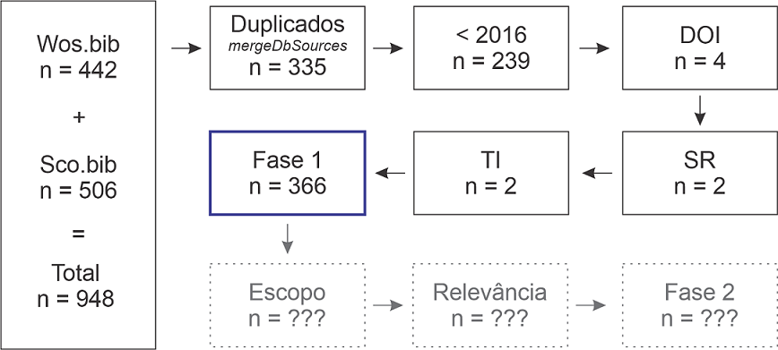

class: center, bottom
background-image: url(Imagens/com.png)
background-position: 50% 30%

```{r setup, include=F}
knitr::opts_chunk$set(echo = FALSE, dpi = 300)
```

```{r script, include=FALSE}
source("Scripts/Script.R", encoding="utf-8", local = knitr::knit_global())
```

```{r logo, echo=FALSE}
xaringanExtra::use_logo(
  image_url = "Imagens/logo_ppg.png",
  link_url = "https://portal.ufgd.edu.br/pos-graduacao/mestrado-agronegocios/index"
)
```

# Objetivo

### Identificar os problemas de comunicação entre agricultores familiares, extensionistas e pesquisadores e as soluções apontadas pela literatura acadêmica sobre o tema. 
----
---
background-image: url(Imagens/big_data.png)
background-position: 80% 50%

# Metodologia
## Análise Bibliométrica
### Coleta de Dados
  - [*Web of Science*](https://www.webofscience.com/wos/woscc/advanced-search)
  - [*Scopus*](https://www.scopus.com/sources.uri)
    
### Período: 
  - 2016 - 2021
  
### Tipos de documentos:
  - Artigos
  - Reviews
---
background-image: url(Imagens/bibliometrix.png)
background-position: 80% 5%

# ETL (Extract Transform Load)
## Seleção dos documentos
<center>


---
# Análise (Fase 1)
### Informações principais
```{r main_information1}
knitr::kable(S$MainInformationDF[2:11,])
```
---
# Análise (Fase 1)
### Informações principais
```{r main_information2}
knitr::kable(S$MainInformationDF[14:25,])
```
---
# Análise (Fase 1)
### Autores mais produtivos
```{r MostProdAuthors}
knitr::kable(S$MostProdAuthors[1:10,1:2])
```
---
# Análise (Fase 1)
### Autores mais produtivos
```{r MostProdAuthors2, out.height=430, fig.align='center'}
graphs.MostProdAuthors <- plot.MostProdAuthors(results, k = 10, 18, 0.6)
```
---
# Análise (Fase 1)
### Autores mais produtivos

- Gao, Yang
  - College of Economics, Qufu Normal University, Shandong, China
- Dorward, Peter T.
  - University of Reading, Reading, United Kingdom
- Gitau, George Karuoya
  - University of Nairobi, Nairobi, Kenya
- Klerkx, Laurens
  - Wageningen University & Research, Wageningen, Netherlands
- Moyo, Martin Philani
  - Matopos Research Station Bulawayo, Bulawayo, Zimbabwe
- Ojo, Temitope O.
  - Obafemi Awolowo University, Ife, Nigeria
- Schut, Marc
  - International Institute of Tropical Agriculture (IITA), Kigali, Rwanda
- VanLeeuwen, John A.
  - University of Prince Edward Island, Charlottetown, Canada

*Fonte: Scopus*
---
# Análise (Fase 1)
### Documentos mais citados
```{r MostCitedPapers}
knitr::kable(S$MostCitedPapers[1:10,1:3])
```
---
# Análise (Fase 1)
### Períodicos com maior número de publicações
```{r MostRelSources}
knitr::kable(S$MostRelSources[1:10,])
```
---
# Análise (Fase 1)
### Colaboração internacional
```{r CountryCollaboration, out.height=435, fig.align='center'}
graphs.CountryCollaboration <- plot.CountryCollaboration(results, k = 10, 18, 0.6)
```
---
```{r colab_country, fig.align='center', message=FALSE, warning=FALSE, out.height=740}
plot(colab_country$graph)
title("Colaboração Científica entre Países")
```
---
# Análise (Fase 1)
### Palavras-chaves mais relevantes
```{r MostRelKeywords}
knitr::kable(S$MostRelKeywords[1:10,])
```
---
```{r net_author_keywords, fig.align='center', out.height=740}
plot(net_author_keywords$graph)
```
---
```{r graph_terms, warning=FALSE, fig.align='center', out.height=600}
CS$graph_terms+labs(title = "Mapa de Estrutura Conceitual")
```
---
```{r wordcloud, warning=FALSE, fig.align='center', out.height=740}
nuvem
```
---
# Análise (Fase 2)

### Contexto da Comunicação

- Farm-Extension-Research
- Farm-Farm
- Farm-Government
- Interinstitutional

### Temas
### Problemas
### Soluções
### Metodologia

---
background-image: url(Imagens/interview.png)
background-position: 80% 50%

# Análise (Fase 2)
## Métodos de análise
### Abordagens Qualitativas
- Entrevistas
- Observação
- *Focus groups*
- Estudos de caso
---
background-image: url(Imagens/data.png)
background-position: 80% 50%
# Análise (Fase 2)
## Métodos de análise

### Abordagens Quantitativas
- Regressão logit
- Modelo de Ricardo com *Double-Hurdle model*
- Fixed effect panel model

### Mixed models
- Social Network Analysis (SNA)
- Experimental design, Fractional factorial design
---
class: center

background-image: url(Imagens/GitHub.png)
background-position: 50% 70%

# Obrigado!

###[https://profmarcelojesus.github.io/mq_apresentacao](https://profmarcelojesus.github.io/mq_apresentacao)

###[https://github.com/profmarcelojesus/mq_apresentacao](https://github.com/profmarcelojesus/mq_apresentacao)